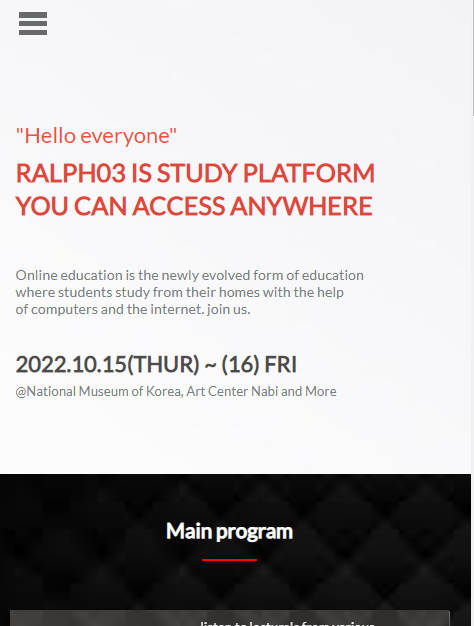
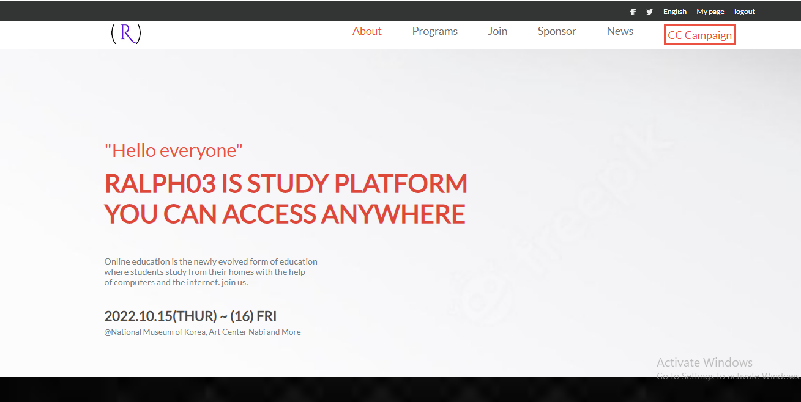

## Getting starting

## Project Name
Ekpenisi Portfolio.

## Description of project.
School project.

## Project web demo link.

## Built With
Html. Css. JS.

## Website link: 

## Getting starting
To get a local copy up and running follow these simple example steps:

# Prerequisites
Vscode.
must have git installed.

# Setup
Clone this repo with:
https://github.com/eerapheal/capstone-project1
cd my-portfolio
## Install
npm install

## Author1
Ekpenisi Erue Raphael.
 
GitHub: (https://github.com/eerapheal) 
Twitter: (https://twitter.com/ekpenisiraphael) 
LinkedIn: (https://www.linkedin.com/in/ekpenisi-e-raphael-9678a221a/)

## 🤝 Contributing
Contributions, issues, and feature requests are welcome!
Feel free to check the [issues page]Fork the Project
Create your Feature Branch (git checkout -b 'branchname')
Commit your Changes (git commit -m 'Add some branchname')
Push to the Branch (git push origin branchname)
Open a Pull Request
Feel free to check the

## Deployment
Push changes to a branch.
Wait for the build to pass on our CI server.
Tell Hubot to deploy it.
Verify that the changes work and fix any problems that come up.
Merge the branch into master.

## Show your support
Give a ⭐️ if you like this project!

## Acknowledgments
.
Cindy Shin in Behance.
My Team.

License
This project is MIT licensed.

